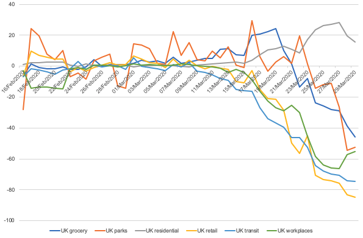

# google-mobility-reports-data

Archive of data related to the Google [Community Mobility Reports](https://www.google.com/covid19/mobility/) published 03/04/2020

This repository contains data extracted from [Google Community Mobility Reports](https://www.google.com/covid19/mobility/) published on the 03/04/2020, together with supporting boundaries based on the current UK administrative geography to allow mapping and linking with other sources of data. 

## Data

The latest data is available in Microsoft Office .xlsx format [here](https://github.com/datasciencecampus/google-mobility-reports-data/blob/master/google-mobility-profiles.xlsx?raw=true), which includes the entire data extracted from the UK report, as well as other international reports. Other datasets include:

- [UK and UK region trends; CSV file](https://github.com/datasciencecampus/google-mobility-reports-data/blob/master/csvs/uk-all-trends.csv)
- [UK headline values; CSV file](https://github.com/datasciencecampus/google-mobility-reports-data/blob/master/csvs/uk-local-areas-percentage-falls.csv)
- [International headline values; CSV file](https://github.com/datasciencecampus/google-mobility-reports-data/blob/master/csvs/uk-international-percentage-falls.csv)
- [UK Boundary Geography files; CSV and GPKG files](https://github.com/datasciencecampus/google-mobility-reports-data/tree/master/geography)

## Background

The [Data Science Campus](https://datasciencecampus.ons.gov.uk/) has extracted the data from Google’s [UK report](https://www.gstatic.com/covid19/mobility/2020-03-29_GB_Mobility_Report_en.pdf) to make it publicly available to all. We developed this [Python tool](https://github.com/datasciencecampus/mobility-report-data-extractor) to achieve this.

The insights are drawn from changes in visits and lengths of stay for different types of locations indexed against median levels, for the same day of the week, over the period 3rd January - 6th February 2020. Google uses aggregated, anonymized sets of data from users who have turned on the Location History setting (off by default). Google caution that the location accuracy and the understanding of categorized places will vary between regions and so advice against using it to compare changes between countries, or between regions with different characteristics (e.g. rural versus urban areas) - please see Google's documentation for [more](https://www.blog.google/technology/health/covid-19-community-mobility-reports) [details](https://www.gstatic.com/covid19/mobility/2020-03-29_GB_Mobility_Report_en.pdf). 

    

Figure 1: UK trends chart rom [Google Community Mobility Reports](https://www.google.com/covid19/mobility/) published on the 03/04/2020. 

Data and methodology cannot be QA’d directly by the Campus and is provided on an ‘as-is’ basis. 

## Python tool: Mobility Report Data Extractor 

    

The Data Science Campus has created a [Python tool (https://github.com/datasciencecampus/mobility-report-data-extractor)](https://github.com/datasciencecampus/mobility-report-data-extractor) for extracting the data points from the graphs for [Google Community Mobility Report PDFs](https://www.google.com/covid19/mobility/). To use this tool, the PDF documents need to be converted to Scalable Vector Graphic (SVG) format. The Campus has converted all G20 (except Russia, and China) countries, plus others. These can be downloaded from this [Google Drive link](https://drive.google.com/open?id=1n5XXYbJtf-wNWEkDPe7N8iNfjzJXwZ_d). These SVG files than then be run through the Python scripts to obtain a Comma Separated Value (CSV) file for each graph in the original report.

This repository contains the CSV files for the UK.

## Boundary data for the UK
The set of boundaries provided in the geopackage is draft, and has been created by ONS in order to promote information sharing and analysis of the effect of COVID19.

The boundaries have been tailored specifically to present ‘Community Mobility’ data (first published by Google on 3 April 2020) recast to administrative boundaries. 
  
The data published by Google covers all of the UK based on the normal Government Statistical  Service (GSS) assignment to 2019 administrative areas - with 3 exceptions. The Unitary Authorities of Bournemouth, Christchurch and Poole; Nottingham; and Telford and Wrekin are missing. In building the boundaries provided here we have assumed that Google have included data for these missing areas within Dorset, Nottinghamshire and Shropshire. Although they do not reflect the current administrative geography we have made use of Ceremonial County versions of Dorset, Nottinghamshire and Shropshire to ensure full geographic coverage of the UK. These boundaries do not reflect current administrative boundaries so care should be taken in how they are used and they should only be used to understand the results published by Google. Further versions of these boundaries may be made available if we are able confirm more details but they are provided here in the hope that they will be helpful to others. 

## Mid-year population estimates for the UK
The [2018 mid-year population estimates for the UK](https://www.ons.gov.uk/peoplepopulationandcommunity/populationandmigration/populationestimates/bulletins/annualmidyearpopulationestimates/mid2018) have been linked to the custom lookup created by ONS. A Standard Area Measurement based on those [produced by ONS Geography](https://geoportal.statistics.gov.uk/search?collection=Dataset&sort=name&tags=all(PRD_SAM) ) has also been included for each area (calculated in hectares). This allows measures such as population density to be calculated.  
